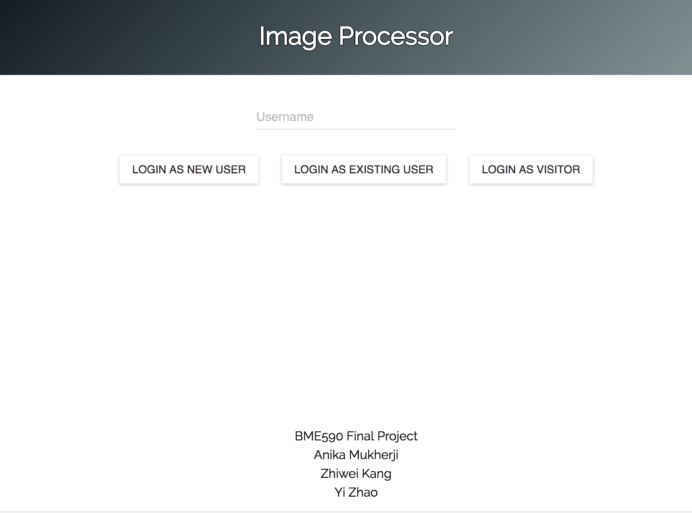
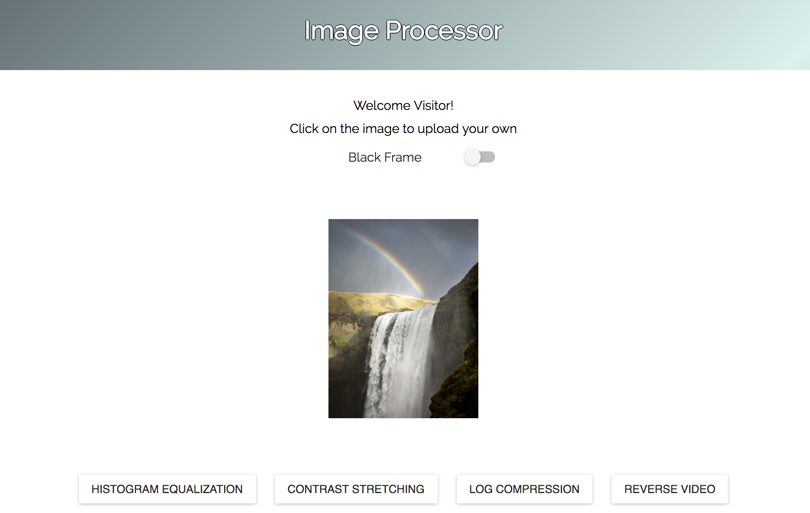
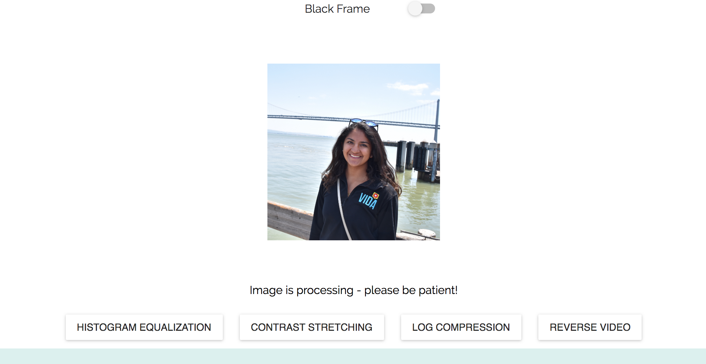
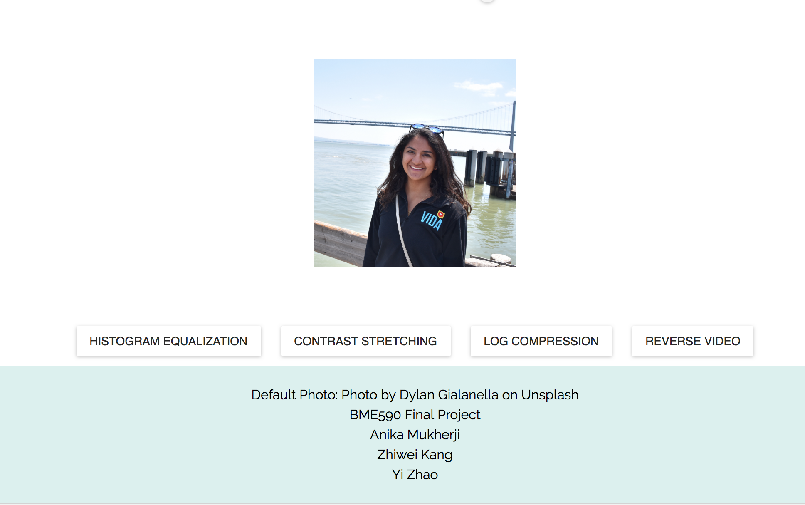
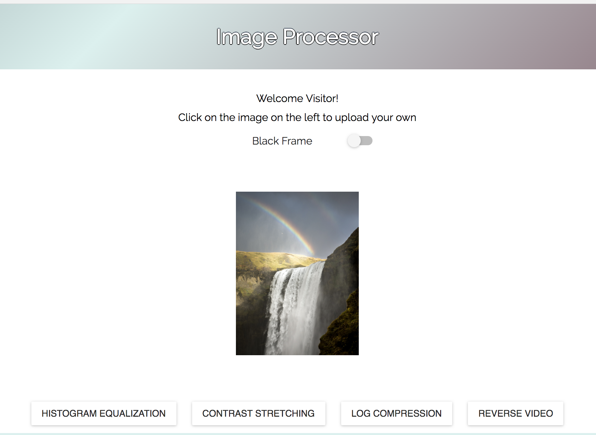
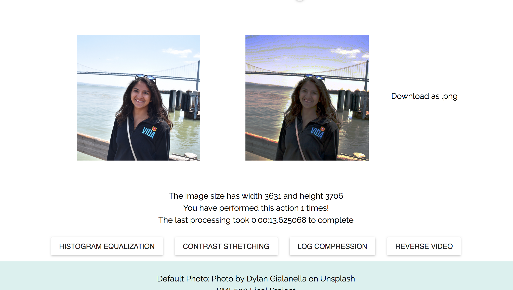

# BME590 Final Project - Image Processing App

## Anika Mukherji
## Zhiwei Kang
## Yi Zhao

[](https://travis-ci.org/anikamukherji/ImageProcessorS18)

Image Processing web app built using React for the BME 590 Spring 2018 final project that calls a server running on a Duke VM.

The module that `server.py` uses to process images is called `image_module` and is located within `Server/`. The frontend part of the project is located within `image_processor_app/`.

To see a more detailed explanation of the API and database models, reference [our RFC here](https://docs.google.com/document/d/1_w9FnVVjGPZUKfDKM6f4p6yuxf_UcSxSMd7z5Rzthxc/edit?usp=sharing)

If you would like to run this app...
```
git clone https://github.com/anikamukherji/ImageProcessorS18.git
cd ImageProcessorS18/image_processor_app
npm install
npm run start
```
Also Here is the `deployed link` to our Web service : http://bme590-learnfast.surge.sh/

## Final performance of this web App
This image processing web app could achieve the following functions:
1. Create user/login as an exsiting user or vistor
2. Upload image one at a time in any formats
3. Customers have four image processing options including histogram equalization, contrast stretching, log compression, and reverse video.
4. Download the processed image in .png format.
5. The customers are able to see how many times they have utilized a particular image processing option, size of their image and the time to process their image.
___

### Here are some images of the app:








